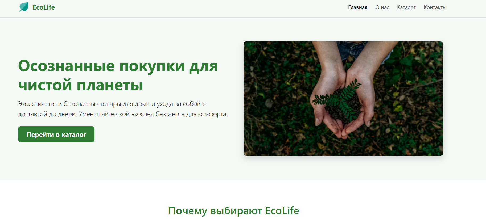
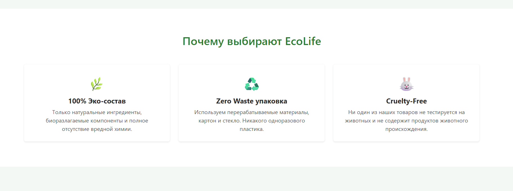

# Landing Page — EcoLife (Экотовары)

## Автор
**Имя:** Дана Кармантаева (Karmantaeva Dana)  
**Группа:** IT1-2310  
**Трек:** B (Bootstrap 5)

## Ссылки
- **Репозиторий GitHub:** https://github.com/danak2404-source/landing-karmantaeva
- **Живая страница (GitHub Pages):** https://danak2404-source.github.io/landing-karmantaeva/

---

## Почему этот инструмент (Bootstrap 5)
Bootstrap 5 — один из самых популярных и надежных CSS-фреймворков для быстрого создания адаптивных интерфейсов. Он значительно ускоряет разработку благодаря готовой 12-колоночной сетке (Grid System) и встроенным компонентам, таким как Navbar с готовым мобильным гамбургер-меню, карточки (Cards) и стилизованные формы. В отличие от написания чистого CSS с нуля, Bootstrap избавляет от необходимости вручную прописывать медиа-запросы (@media) для каждого элемента, обеспечивая корректное отображение на смартфонах, планшетах и ПК. Главное преимущество Bootstrap 5 перед версткой на чистом CSS или Sass — стандартизация кода и высокая скорость сборки. Однако у инструмента есть и минусы: избыточность стандартных CSS-стилей при подключении полного CDN и узнаваемый «типовой» внешний вид компонентов, если не кастомизировать CSS-переменные фреймворка.

---

## Адаптив (Responsive Design)
Сайт протестирован и адаптирован под три основные ширины экрана:
- **Мобильные устройства (375px):** Навигационное меню сворачивается в гамбургер-кнопку (toggler), карточки товаров и преимуществ располагаются по 1 в ряд (`col-12`).
- **Планшеты (768px):** Сетка перестраивается на 2 колонки (`col-md-6`).
- **Десктопы (1280px):** Полноразмерное горизонтальное меню, карточки располагаются по 3 в ряд (`col-lg-4`).

### Скриншоты адаптивной верстки:

#### 375px (Мобильная версия)

#### 768px (Планшетная версия)

#### 1280px (Десктопная версия)

